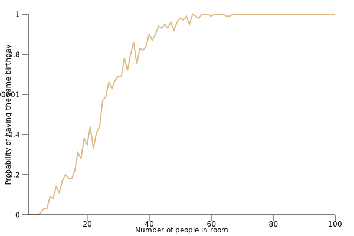

# Birthday Paradox Monte Carlo Simulation
- Runs in parallel courtesy of [Rayon](https://github.com/rayon-rs/rayon)

```
Usage: birthday_paradox_sim [options]

Options:
    -n CYCLES           set number of cycles to run
    -p PEOPLE           set number of people to test for birthday collisions
    -h, --help          print this help menu

```

## Chart of number of birthday collisions from 0 to 100 people in room with 100 cycles 
